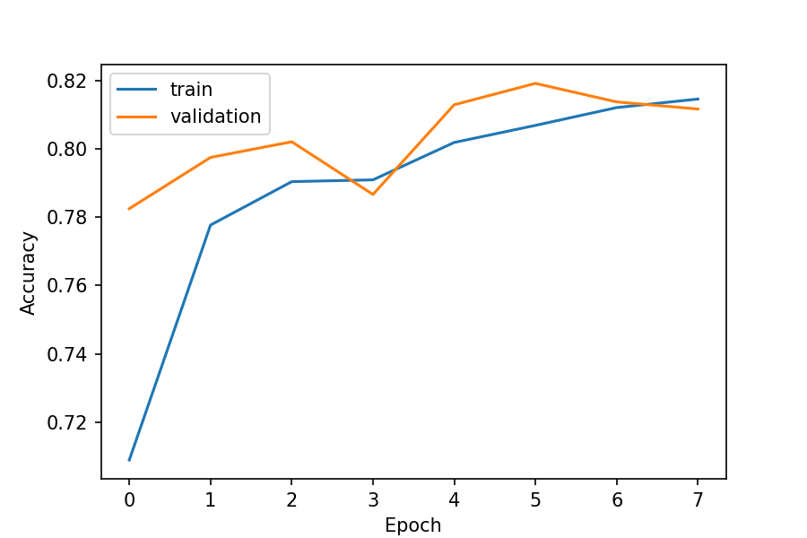
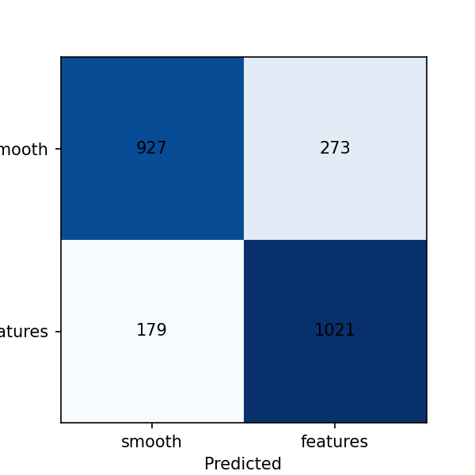

# 🌌 Galaxy Morphology Classifier (CNN)

Classifying galaxy images as **smooth** or **featured** (spiral arms, disks, bars) with a small Convolutional Neural Network, using Galaxy Zoo volunteer labels.

🔗 **Kaggle notebook:** PASTE-YOUR-KAGGLE-LINK-HERE 
https://www.kaggle.com/code/bhattpremjack/galaxy-morphology-classifier-cnn
## 🎯 Goal
Build a baseline deep-learning model that separates smooth galaxies from featured galaxies using only their images.

## 📂 Data
- Galaxy Zoo – The Galaxy Challenge (Kaggle)
- Label: the most voted answer to Galaxy Zoo question 1 (smooth / features / star or artifact)
- 59 star/artifact images were dropped
- Balanced subset: **12,000 images** (6,000 smooth + 6,000 featured)

## 🛠️ Method
1. Center-cropped each image and resized it to **64×64** pixels
2. Stratified **80/20** train/validation split
3. CNN: 3 × (Conv2D + MaxPooling), Flatten, Dropout(0.3), Dense(64), Sigmoid output
4. Trained for 8 epochs with Adam and binary cross-entropy

## 📊 Results
**Validation accuracy: about 81.8%** (1963 of 2400 images correct). Precision and recall are about 0.81–0.83 for both classes.

|  | Predicted smooth | Predicted featured |
|---|---|---|
| **True smooth** | 991 | 209 |
| **True featured** | 228 | 972 |

## ⚠️ Limitations
- Small CNN and low resolution (64×64), so fine details like faint spiral arms are lost
- Labels come from volunteer votes and can be noisy for borderline galaxies
- Only 12,000 of about 61,000 images were used
- Trained on CPU for a short time

## 🔭 Next steps
Higher resolution, more data, augmentation, and transfer learning (for example ResNet).

## 🧰 Tools
Python, NumPy, pandas, Pillow, scikit-learn, TensorFlow/Keras, Matplotlib (Kaggle Notebooks)
